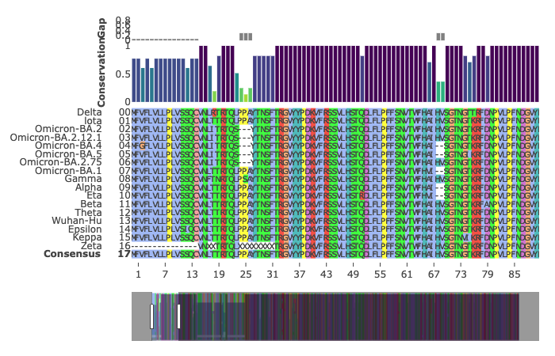

🧬 SARS-CoV-2 Spike Protein MSA & Phylogenetic Analysis

Computational Biology Lab Assignment

(Based on file extensions, tools like MEGA or Clustal seem to be used)

📌 Overview

This repository contains a Multiple Sequence Alignment (MSA) and Phylogenetic Tree Construction project focusing on the Spike protein sequences of 16 different SARS-CoV-2 variants, conducted as part of a Computational Biology lab assignment.

The primary objective is to comparatively analyze these Spike protein sequences to structurally visualize their evolutionary relationships and identify key mutation patterns that define different clades and lineages (e.g., the massive divergence of the Omicron lineage from pre-Omicron variants).

🛠️ Methods & Tools

💡 Based on the file types (.tree, .dnd) in the repository, tools like MEGA or ClustalW/X were likely utilized for alignment and tree construction.

Input Data: Spike protein sequences of 16 variants in FASTA format.

MSA Method: ClustalW/X or Muscle alignment (likely via MEGA).

Phylogenetic Algorithm: Neighbor-Joining (NJ) or Maximum Likelihood (ML) (Commonly used for viral evolutionary analysis).

Visualization Tools: MEGA, FigTree, or similar software for tree and alignment visualization.

📁 Repository Structure & File Description

README.md: Project documentation (this file).

MSA_16variants.png: Visualization of the Multiple Sequence Alignment for 16 variants. It shows the aligned amino acid residues and a 'ConservationGap' plot at the top, indicating highly conserved vs. hypervariable regions.

Phylogenetic_Tree.png (Assumed output image): Visual representation of the constructed phylogenetic tree, based on the image_1.png provided as result data.

SpikeProteins.fa, SpikeProteins.fas: Input FASTA files containing the raw Spike protein sequences of the 16 SARS-CoV-2 variants.

SpikeProteins.tree, SpikeProteins.dnd: Tree data files (e.g., in Newick or Clustal dendrogram format) representing the inferred evolutionary relationships.

📊 Key Results & Visualizations

1. Multiple Sequence Alignment (MSA) Analysis

The image below (MSA_16variants.png) displays the detailed sequence alignment of the Spike protein for 16 SARS-CoV-2 variants. The color coding highlights amino acid conservation and differences.

ConservationGap: The graph at the top indicates a high degree of conservation in many regions (tall bars), interspersed with several highly variable regions (shorter or gaps in bars). These variable regions are likely key mutation hotspots that differentiate the variants and affect viral function (e.g., infectivity, immune evasion).

Variant Specificity: Detailed inspection of specific regions (like the one shown) allows for identifying mutations characteristic of lineages like Omicron vs. Delta. Note, for instance, the distinct sequence pattern for the 'Zeta' variant in certain regions.

2. Phylogenetic Analysis

The constructed phylogenetic tree (Phylogenetic_Tree.png, based on provided result data) clearly visualizes the evolutionary distances between the variants.

Clade Divergence: A major finding is the clear, distinct separation of the Omicron lineage (including BA.1, BA.2, BA.4, BA.5, etc.) into a massive, derived clade, distant from the main group of pre-Omicron variants like Wuhan-Hu, Alpha, and Delta.

Bootstrap Confidence: Values at the nodes (e.g., 1 and 0.894 defining the Omicron lineage branch) indicate strong bootstrap confidence in these major evolutionary divergences.

🚀 Analysis Workflow (Conceptual)

Note: Since analysis scripts are not included in the repository, this describes a general workflow using standard bioinformatic tools like MEGA.

Data Loading: Open SpikeProteins.fa (or .fas) in a sequence analysis software (e.g., MEGA).

Alignment: Perform MSA using ClustalW or Muscle algorithms. Export alignment visualization (result in MSA_16variants.png).

Phylogeny Inference: Construct a phylogenetic tree (e.g., using NJ or ML). Export tree data files (SpikeProteins.tree, SpikeProteins.dnd).

Visualization: Open tree data files in a tree viewer (e.g., FigTree) and generate the finalized tree image (Phylogenetic_Tree.png).

👨‍💻 Author

GitHub: @OHfromH2O

Course: [KUL, Computational Biology Lab, Autumn 2023]
